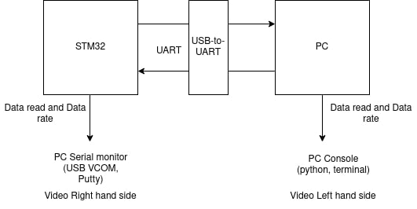

# Embedded software task submission

## MCU Code
### MCU used : STM32F103C8T6
- STM32CubeIDE project, peripheral initialization done using STM32CubeMX utility.
- "C++" compatible.
- Transfers data string over UART via a cyclic DMA transfer.
- Reads data on UART, calculates read speed and prints out both to USB VCOM.

## PC Code
## Written in python
- Requires ***pySerial*** package to run

## Test setup

> This repository contains a video showing the outputs from both ends.

